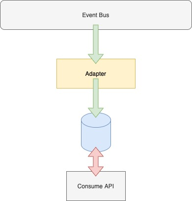

## Learning micro services

### What to build : 

:warning: If you have an M1 Chip, you'll need to install the [docker-desktop RC3](https://docs.docker.com/docker-for-mac/apple-m1/).
And use the adm64 version of the nginx image:  
`docker pull --platform linux/amd64 nginx`

Orginal tutorial from QBrain :
https://www.youtube.com/watch?v=Ry9ybOaMJYg
